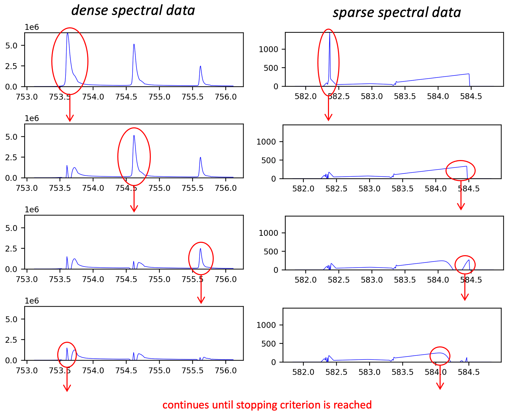
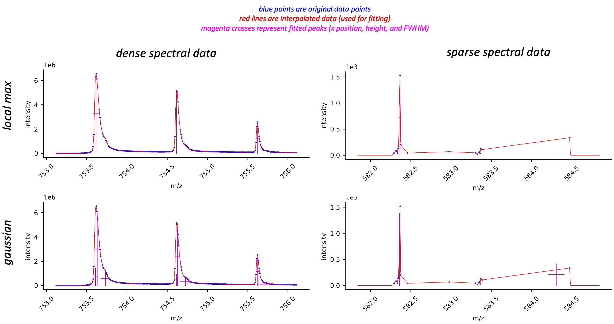

``mzapy.peaks``
=======================================
This module defines functions for performing basic signal processing and peak finding.

1D Peak Fitting
-------------------------------------
Two functions are provided for performing peak fitting on 1-dimensional data: 
``mzapy.peaks.find_peaks_1d_localmax`` and ``mzapy.peaks.find_peaks_1d_gauss`` which use local maximum
or sequential gaussian fitting methods, respectively. The local maximum method uses the
`scipy.signal.find_peaks <https://docs.scipy.org/doc/scipy/reference/generated/scipy.signal.find_peaks.html>`_
function internally. The gaussian fitting method consists of performing successive rounds of least-squares
fits using a `gaussian function <https://en.wikipedia.org/wiki/Gaussian_function>`_ to the data, with each
successive round of fitting performed using the residuals of the previous fit. This process continues until
a stopping criterion is reached:

- peak height is lower than a specified absolute or relative threshold
- a maximum number of peaks have been found

*The following image is an demonstration of the sequential gaussian fitting method, performed using dense
and sparse spectral data:*

Which of the two fitting functions is best to use depends on the type of signal being fit, and both will most
often require some trial and error to determine the best parameters for a given application. For very clean
signals containing generally well-formed and well-resolved peaks, both methods will produce roughly equal
results. If the peaks have clearly defined apexes but have significant shoulders, tailing, or other 
deviations from ideal peak shape, the localmax method with generally provide better estimates of the mean
x value of the peak. However, if the peaks are very broad or saturated then the sequential gaussian fit
method will provide more reliable estimates of the mean x value of the peak. In cases where peaks have a
clear multimodal distribution (up to 2 or 3 peaks that are not completely resolved), the sequential gaussian 
fit method generally does a better job of deconvoluting the unresolved peaks. 

*The following image shows some examples of the different outcomes of the two peak fitting methods using
dense and sparse spectral data:*

          fitted peaks using localmax or gaussian methods
    :align: center

Module Reference
---------------------------------------

Interpolation
***************************************

.. autofunction :: mzapy.peaks.lerp_1d

.. autofunction :: mzapy.peaks.lerp_2d

Peak Finding
***************************************

.. autofunction :: mzapy.peaks.find_peaks_1d_localmax

.. autofunction :: mzapy.peaks.find_peaks_1d_gauss

Miscellaneous
***************************************

.. autofunction :: mzapy.peaks.calc_gauss_psnr

.. autofunction :: mzapy.peaks.calc_peak_area

