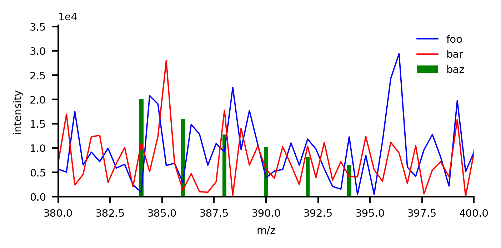
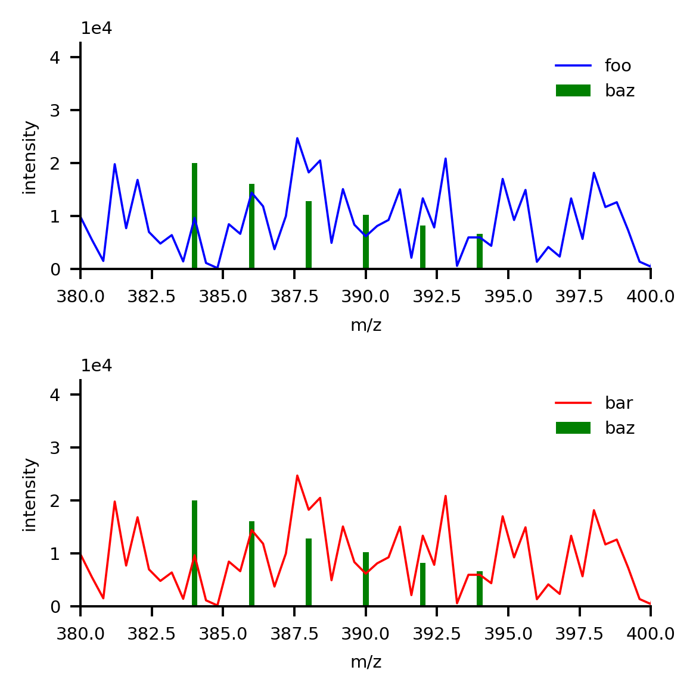

``mzapy.view``
=======================================
This module defines functions for interactive viewing and/or generating plots of extracted data. Plotting functions
are implemented to maintain a consistent look and feel, with a flexible interface that allows for customization or 
generating more complex plots when needed. 

Flexible Plotting System
---------------------------------------
The plotting functions in this module all implement an interface that allows for flexibility in how plots are 
generated. Each plotting function takes as input some data to plot with some customization/configuration parameters 
(things like line color, *etc.*), in addition to the ``ax`` and ``figname`` kwargs which control how the plot is
constructed and what is done with the plot. ``figname``, when provided, can be set to ``"show"`` or an image file name
which prompts the plotting function to display the plot interactively or save it to file, respectively. If no
``figname`` is provided, however, instead of viewing or saving the plot the plotting function will return a 
``matplotlib.pyplot.Axes`` instance so that further customization can be performed or more data can be plotted in the
same panel. The ``ax`` kwarg, when provided, tells the plotting function to skip setup/customization, and
instead just plot the data into the provided ``matplotlib.pyplot.Axes`` instance. Custom plotting functions can 
be implemented with this same interface by using the :func:`mzapy.view._setup_and_save_or_show_plot` decorator 
(see documentation for template plotting function).

*Below is a script with several examples demonstrating how to construct different plots using the same function but 
with different parameters using this flexible plotting system*

.. code-block:: python3
    :caption: Example of flexible plotting system (using ``plot_spectrum`` function)

    import numpy as np
    from matplotlib import pyplot as plt

    from mzapy.view import plot_spectrum

    def make_some_fake_data():
        mz = np.linspace(100, 500, 1001)
        i1 = np.abs(np.random.normal(size=mz.shape)) * 10000
        i2 = np.abs(np.random.normal(size=mz.shape)) * 10000
        return mz, i1, i2

    def main():
        # arbitrary arrays meant to mimic mass spectrum data
        # one array of m/z and two arrays of intensities
        mz, i1, i2 = make_some_fake_data()

        # do a single plot, no label, default figsize, show it
        plot_spectrum(mz, i1, [380, 400], figname='show')

        # do a single plot, no label, different figsize, show it
        plot_spectrum(mz, i1, [380, 390], figname='show', figsize=[2.22, 2.22])

        # do a single plot, label it, different figsize, show it
        plot_spectrum(mz, i1, [380, 390], label='foo', figname='show', figsize=[2.22, 2.22])

        # do a single plot, label it, different figsize, save it
        plot_spectrum(mz, i1, [380, 390], label='foo', figname='figures/test01.png', figsize=[2.22, 2.22])

        # do a combined plot, with labels, different figsize, show it
        ax = plot_spectrum(mz, i1, [380, 400], label='foo', figsize=[4, 2])
        plot_spectrum(mz, i2, c='r', label='bar', ax=ax, figname='show')

        # do a combined plot, with labels, different figsize, save it
        ax = plot_spectrum(mz, i1, [380, 400], label='foo', figsize=[4, 2])
        plot_spectrum(mz, i2, c='r', label='bar', ax=ax, figname='figures/test02.png')

        # do a combined plot, with labels, different figsize, add some bars to it, save it
        ax = plot_spectrum(mz, i1, [380, 400], label='foo', figsize=[4, 2])
        ax = plot_spectrum(mz, i2, c='r', label='bar', ax=ax)
        ax.bar([384, 386, 388, 390, 392, 394], 
            [20000, 16000, 12800, 10240, 8192, 6554], 
            width=0.2, color='g', label='baz')
        ax.legend(frameon=False)  # need to add in the legend since that is only added when showing/saving
        plt.tight_layout()
        plt.savefig('figures/test03.png', dpi=350, bbox_inches='tight')
        plt.close()

        # plot each trace in separate panels, with labels, add bars to both, save it
        fig, axs = plt.subplots(nrows=2, figsize=(3.33, 3.33))
        ax0 = plot_spectrum(mz, i1, [380, 400], label='foo', ax=axs[0], ign_newax=True)
        ax0.bar([384, 386, 388, 390, 392, 394], 
                [20000, 16000, 12800, 10240, 8192, 6554], 
                width=0.2, color='g', label='baz')
        ax0.legend(frameon=False)  # need to add in the legend since that is only added when showing/saving
        ax1 = plot_spectrum(mz, i1, [380, 400], c='r', label='bar', ax=axs[1], ign_newax=True)
        ax1.bar([384, 386, 388, 390, 392, 394], 
                [20000, 16000, 12800, 10240, 8192, 6554], 
                width=0.2, color='g', label='baz')
        ax1.legend(frameon=False)  # need to add in the legend since that is only added when showing/saving
        plt.tight_layout()
        plt.savefig('figures/test04.png', dpi=350, bbox_inches='tight')
        plt.close()

    if __name__ == '__main__':
        main()

The images below are the last two plots from the above code example.

*(single panel)*

*(two panels)*

Module Reference
---------------------------------------

.. autofunction :: mzapy.view.plot_spectrum

.. autofunction :: mzapy.view.plot_chrom

.. autofunction :: mzapy.view.plot_atd

.. autofunction :: mzapy.view.add_peaks_to_plot

.. autofunction :: mzapy.view._setup_and_save_or_show_plot

